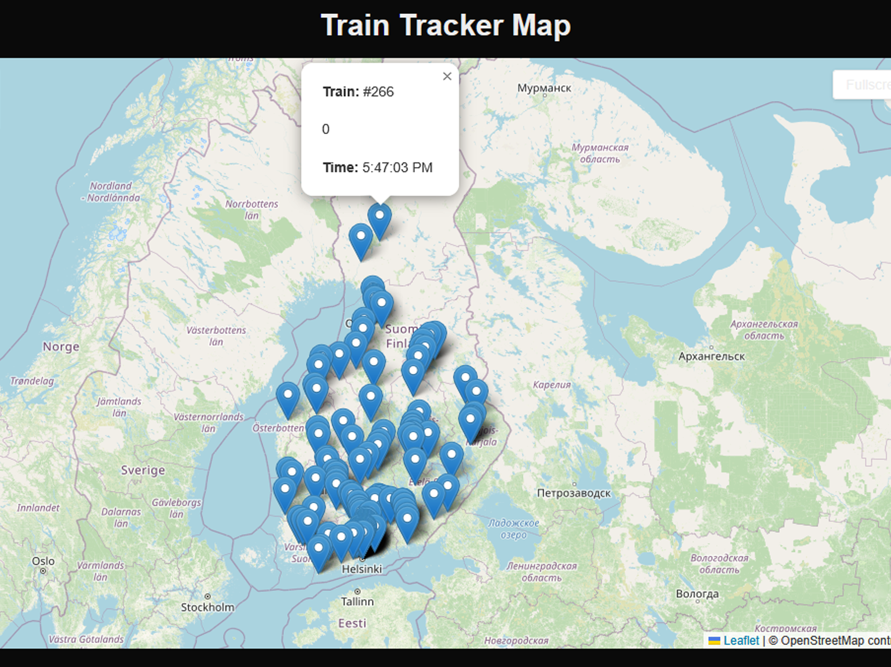

 Train Tracker Map (DigiTraffic API)

This project is a simple web app that shows live train locations in Finland using the **DigiTraffic API** and displays them on an interactive map.


Features

-  Real-time train positions shown on a map
-  Automatic data refresh every 30 seconds
-  Clickable markers to show train number, speed, and timestamp
-  Fullscreen map toggle

---

 Technologies Used

- Next.js 14
- React Leaflet
- Leaflet.js
- Tailwind CSS
- TypeScript

---

How to Run Locally

1. Clone this repo:
   ```bash
   git clone https://github.com/thedogukandizman/train-map-app.git
   cd train-map-app


